# Project Installation
### Clone Repository
After cloning the repository to your local environment, run the following command in the project's root to install the server dependencies:
`npm install`

Once the back-end dependencies are installed, move to the client folder using:
`cd client/`

Inside the notes-react-node/client/ directory, install the front-end dependencies using:
`npm install`

### Project Structure
This project is organized as a monorepo, with the root folder named notes-react-node. It contains all the necessary files and folders.
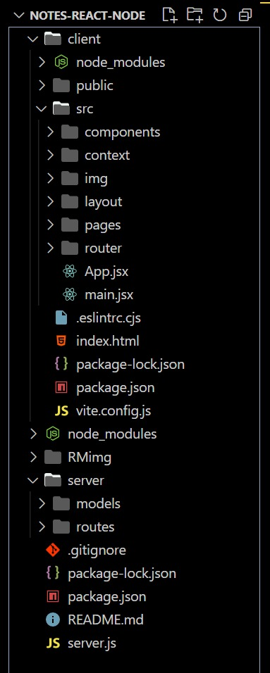


#### client
This folder contains all front-end related code.

- src/components/
Contains general components.

- src/context/
Contains the hook used for session context (useContext).

- src/img/
Contains the images used in the project.

- src/layout/
Contains the main UI components.

- src/pages/
Contains the main page components.

- src/router/
Contains the components for public and private routes.

#### server
Contains the server-side code.

- models/
Contains the models for database table entities.

- routes/
Contains the routes for interactions with the database.

### Running the Project
Before starting, make sure you have MySQL installed. Then, go to the file [ notes-react-node/server/models/mysql.js ], and replace the password in line 6 with your root user password.

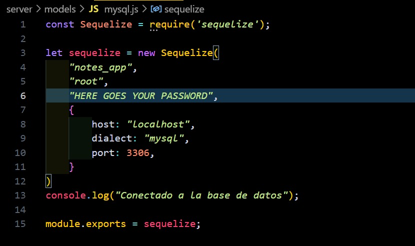

Ensure that you have the [ users ] and [ notes ] tables.
You can create them using the following lines:
```
CREATE TABLE `users` (
    `id` INT AUTO_INCREMENT PRIMARY KEY,
    `name` VARCHAR(255),
    `email` VARCHAR(255),
    `password` VARCHAR(255),
    `createdAt` DATETIME,
    `updatedAt` DATETIME,
    `deletedAt` DATETIME
);

CREATE TABLE `notes` (
    `id` INT AUTO_INCREMENT PRIMARY KEY,
    `title` VARCHAR(255),
    `description` VARCHAR(255),
    `user_id` INT,
    `createdAt` DATETIME,
    `updatedAt` DATETIME,
    `deletedAt` DATETIME,
    FOREIGN KEY (`user_id`) REFERENCES `users` (`id`)
);
```

To run the project, navigate to the root directory and use the following command:
`npm run dev`

This will start both the back-end and front-end servers.

### Interacting with the Project
- Upon the initial visit, the project displays the Login page on the public route to login or register:
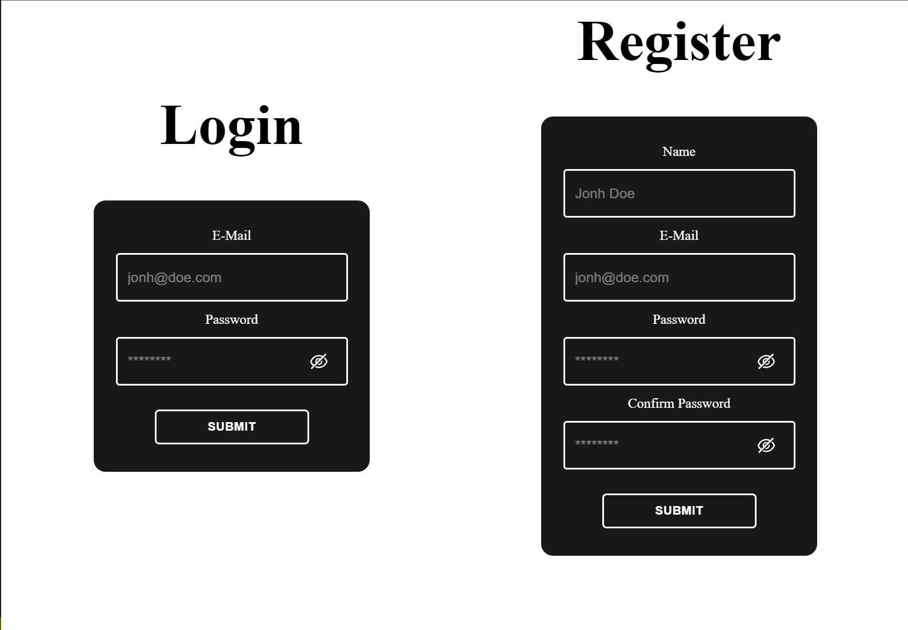

- After logging in or registering, you will be redirected to the main page to manage your notes:
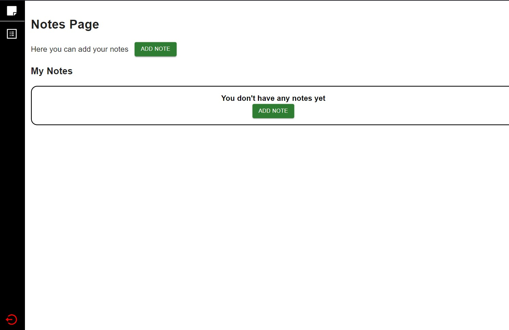

- Clicking on the "ADD NOTE" button will open a modal to add notes:
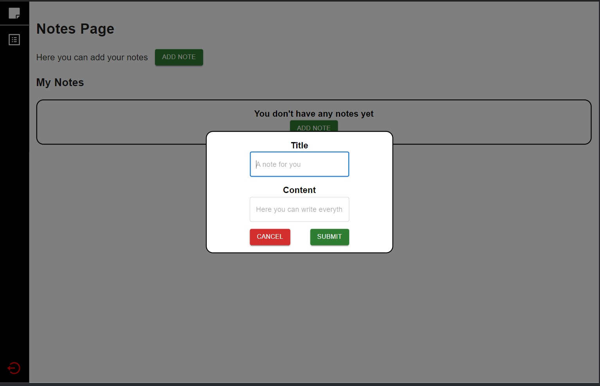

- This modal allows you to add notes with a maximum of 100 characters in the title and 1000 characters in the description. If you exceed these limits, it will show an error and prevent saving the note:
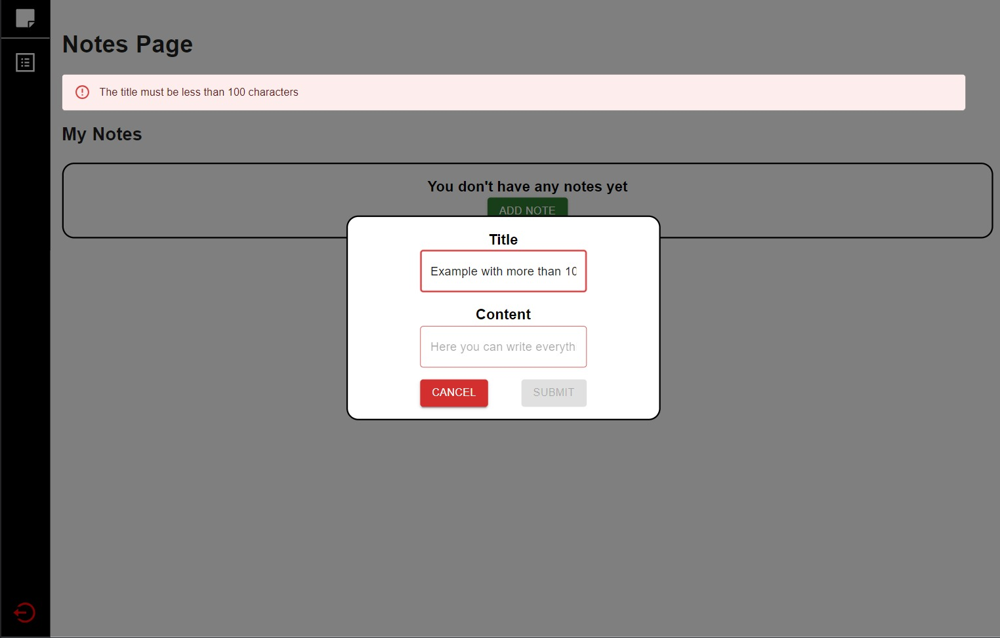

- When you enter a valid note and click the "Submit" button, the note will be added to the list, and a confirmation message will appear:
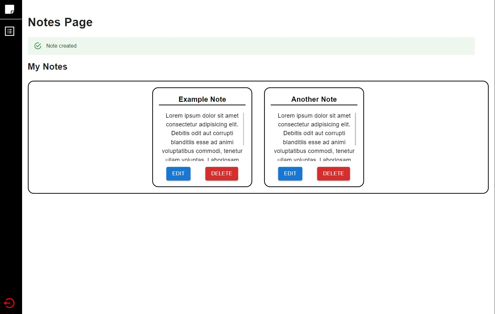

- You can edit your notes by clicking the "EDIT" button, which will open a modal for editing:
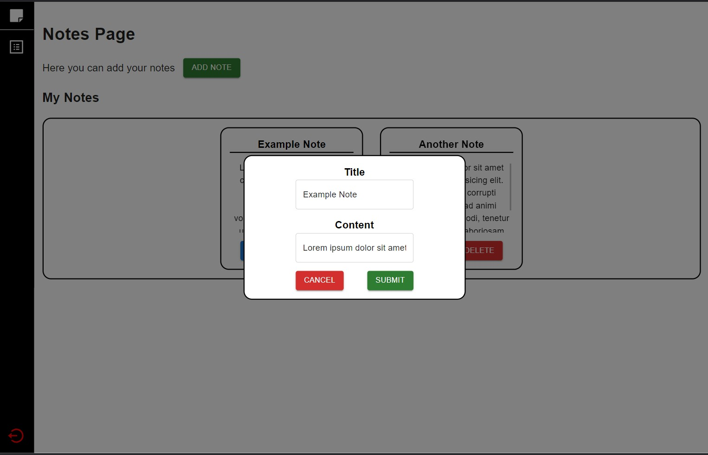

- This modal will also alert you if you exceed the character limit in the title or content. If your note complies with the guidelines, you can update it by clicking the "SUBMIT" button, which will update your note and display a confirmation message:
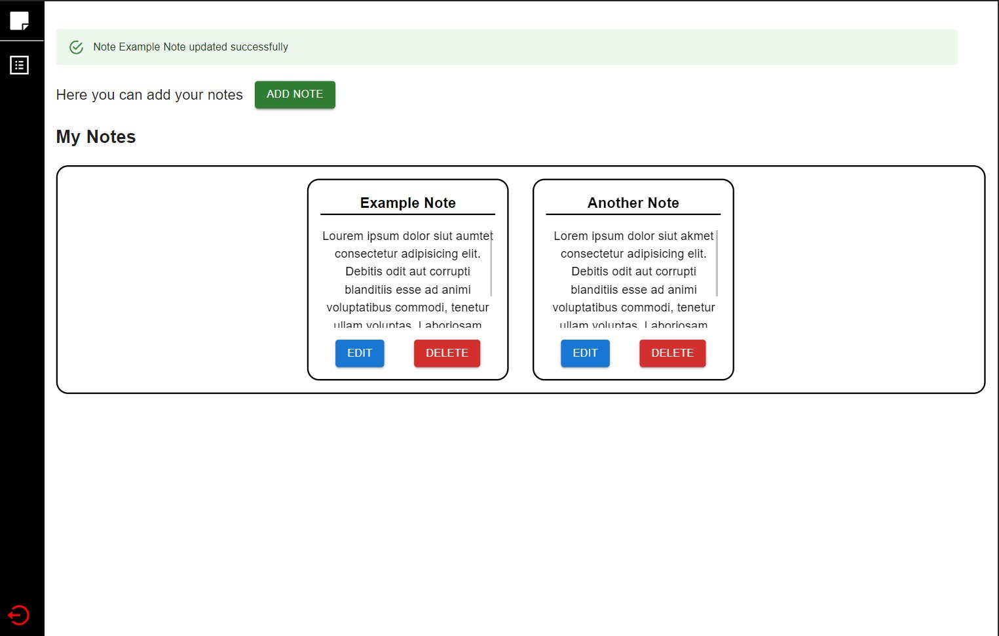

- You can also delete a note by clicking the "DELETE" button, which will display a modal to confirm the deletion:
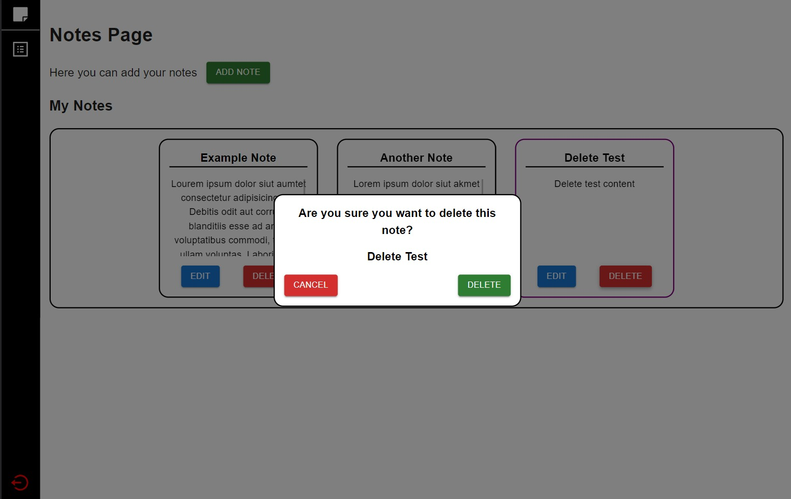

- Finally, you can log out by clicking the red bottom sidebar button:
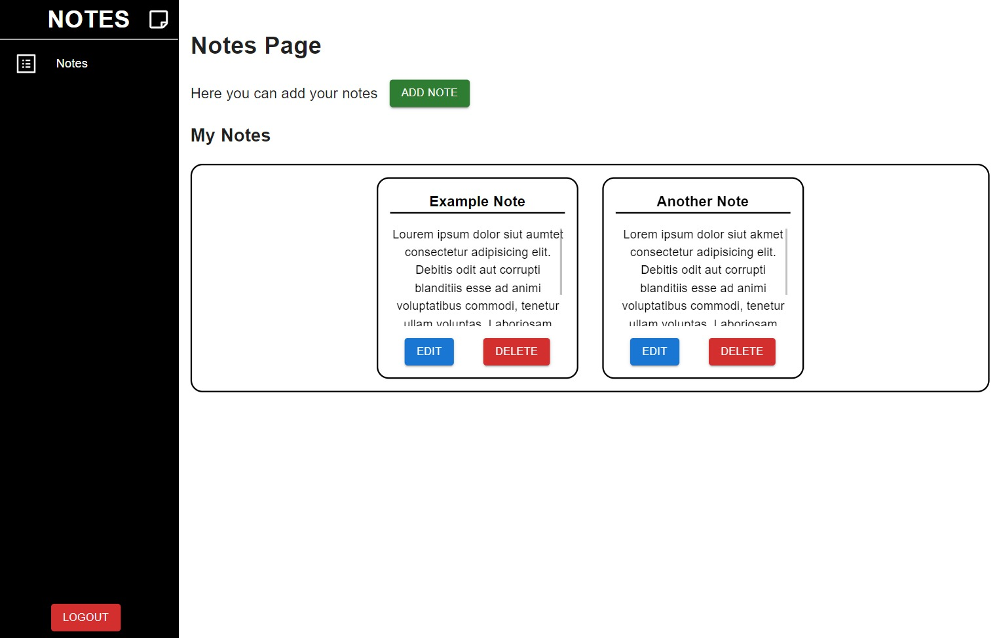


# Instalacion del proyecto

### Clonar Repositorio
Despues de clonar el repositorio en tu entorno local deberas correr el siguiente comando en la raiz del proyecto para instalar las dependencias del servidor:

`npm install`

Una vez se hayan terminado de instalar las dependencias del back nos moveremos a la carpeta del front con el comando:

`cd client/`

Una vez en el directorio notes-react-node/client/ deberemos instalar las dependencias con el comando:

`npm install`

### Estructura del proyecto
Este pryecto esta creado como un monorepo, tenemos nuestra carpeta Raiz que es en donde se encuentran todos los archivas y carpetas que lo componen [ notes-react-node ]

    

##### client
Esta es la carpeta donde se encuentra todo lo relacionado al Front

- src/components/
Contiene componentes generales

- src/context/
Contiene el hook que usamos para el contexto de la sesion (useContext)

- src/img/
Contiene las imagenes que se utilizaron

- src/layout/
Contiene los componentes principales del de la UI

- src/pages/
Contiene los componentes principales de las paginas

- src/router/
Contiene los componentes de las rutas publicas y privadas

#### server
- models/
Contiene los modelos de las entidades de las tablas de base de datos

- routes/
Contiene las rutas para las interacciones con la base de datos

### Correr el proyecto
Antes que nada asegurate de tener MySQL instalado.
Despues ve al archivo mysql.js en la ruta notes-react-node/server/models/mysql.js y coloca la contrasena de tu usuario root en la linea 6


Despues asegurate de tener las tablas users y notes, las puedes crear con el siguiente comando:

```
CREATE TABLE `users` (
    `id` INT AUTO_INCREMENT PRIMARY KEY,
    `name` VARCHAR(255),
    `email` VARCHAR(255),
    `password` VARCHAR(255),
    `createdAt` DATETIME,
    `updatedAt` DATETIME,
    `deletedAt` DATETIME
);

CREATE TABLE `notes` (
    `id` INT AUTO_INCREMENT PRIMARY KEY,
    `title` VARCHAR(255),
    `description` VARCHAR(255),
    `user_id` INT,
    `createdAt` DATETIME,
    `updatedAt` DATETIME,
    `deletedAt` DATETIME,
    FOREIGN KEY (`user_id`) REFERENCES `users` (`id`)
);
```

Para correr el proyecto deberemos colocarnos en el directorio raiz y correr el comando:

`npm run dev`

Esto levantara el servidor del back y del front en la misma consola.

### Interactuar con el proyecto
- Cuando ingresamos por primera vez, el proyecto desplegara la pagina Login en la ruta publica para iniciar sesion o registrarnos:


- Una vez que iniciemos sesion o que nos registremos nos direccionara a la pantalla principal para administrar nuestras notas:


- Al dar click en ADD NOTE se desplegara el modal para agregar las notas:


- Este modal nos dejara agregar notas con un maximo de 100 caracteres en el titulo y 1000 en la descripcion, si exedemos estas longitudes mostrara un error y no permitira guardar la nota:


- Cuando ingresas una nota valida y das click en el boton de submit agrega la nota al listado y despliega la confirmacion


- Despues podras editar tus notas dando click en el boton EDIT, esto desplegara un modal para que puedas editar tu nota


- Este modal tambien esta preparado para avizarte si exedes el limite de caracteres en el titulo o el contenido, si tu nota cumple con las normas podras actualizarla dando click en el boton SUBMIT, lo que actualizara tu nota y te confirmara con un aviso


- Tambien puedes eliminar una nota si lo deseas dando click en el boton DELETE, lo que desplegara un modal que te pediraconfirmar la eliminacion de la nota


- Por ultimo, podras cerrar sesion dando click en el boton inferior rojo del sidebar
